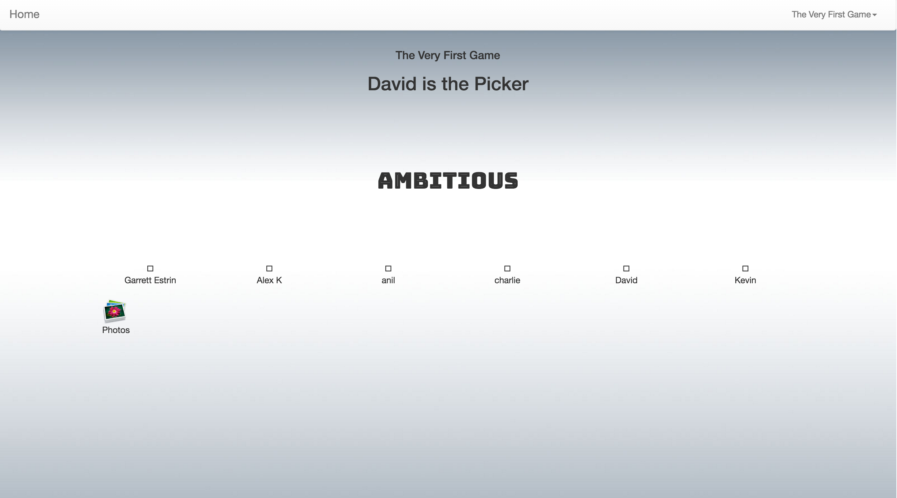
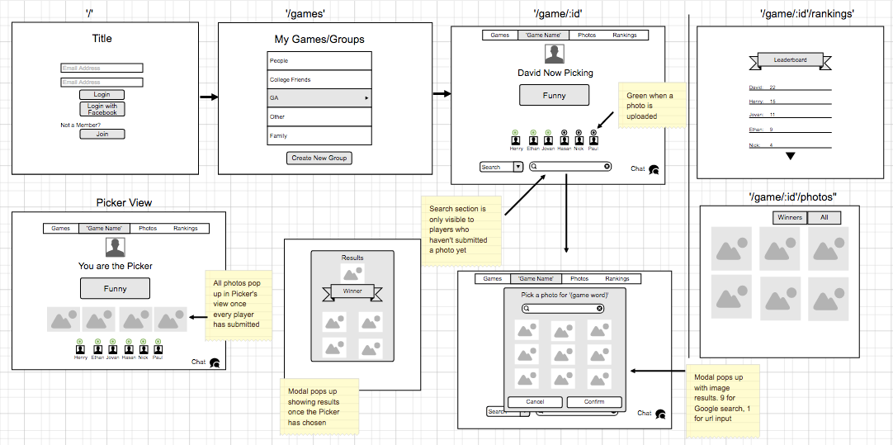

# A Word is Worth One Picture

### A node.js based web app where users can play a word and image based game.

Users can create and login in to the web app and create see games that they are playing in

## To use the app

Visit [A Word is Worth One Picture ](https://infinite-eyrie-42957.herokuapp.com )to use the app as a user.

Visit [A Word is Worth One Picture GitHub ](https://github.com/djw11192/Project-3) to download the app to your local machine.

This app was built with Node.js.

### Local installation instructions

Download the repository to your preferred directory.

 Start a MongoDB local database.

 From the terminal and in your installation directory run

 `npm install`

 to install the dependent packages.

 Start the server by running the command

 `nodemon`

 in the terminal from your installation directory.

 [localhost:3000 ](localhost:3000)

 to use the site locally.

### Development process

Technologies used: HTML / CSS + Bootstrap / Node + Javascript + jQuery / MongoDB

The app was generated using node.js

## User Stories

As a user, I can register a new account with minimal information.

As a user, I can login and be directed to the games page.

As a user, I can create a new game.

As a user, I can view and participate in games I create and am added too.

As a user, I can view all pictures that have been submitted for a specific game.

As a user, I can logout out of the website from the navigation bar.

## Future implementations

* Show scores on game page.

* Picture comments.

* Use sockets to have live gameplay.

## Feature Wish List

* Live chat.

* Notifications.
